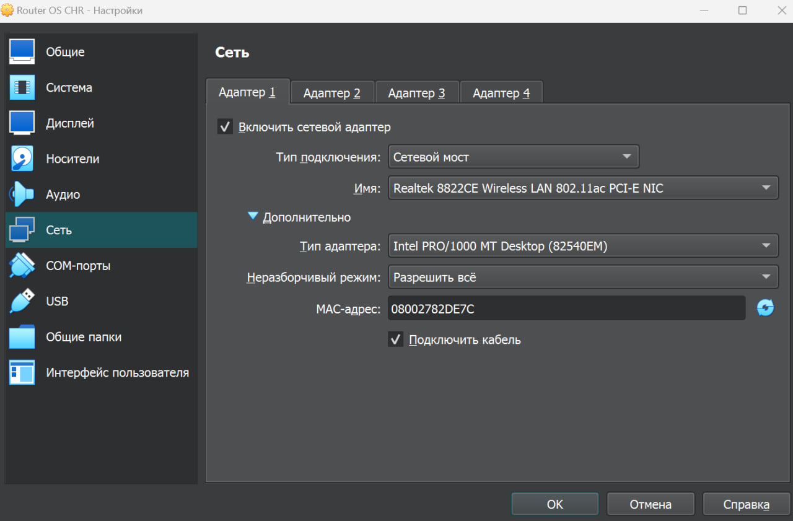
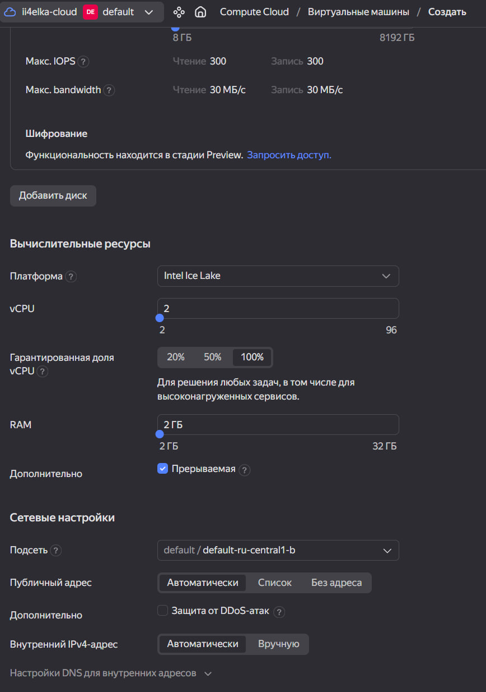
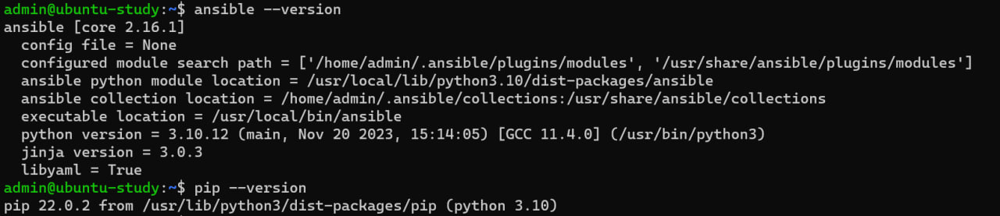

#### University: [ITMO University](https://itmo.ru/ru/)

##### Faculty: [FICT](https://fict.itmo.ru)

##### Course: [Network Programming](https://itmo-ict-faculty.github.io/network-programming/)

Group: K34202

Author: Konovalenko Maxim Pavlovich

Lab: Lab3

Date of create: 06.12.2023

Date of finished: 06.12.2023

## Отчёт по лабораторной работе №1 "Установка CHR и Ansible, настройка VPN"

**Цель работы:** Целью данной работы является развертывание виртуальной машины на базе платформы Microsoft Azure с установленной системой контроля конфигураций Ansible и установка CHR в VirtualBox.

**Ход работы:**

### 1. Создание вирутальной машины с RouterOS и подключение через WinBox.

С официального сайта [Mikrotik](https://mikrotik.com/download/archive) скачали образ диска .vdi. Создали виртуальную машину, используя Virtualbox и ранее скачанный образ. В настройках сети ВМ выбрали тип сети - Сетевой мост и Разрешить всё.




Для использования графического интерфейса подключились к CHR с помощью WinBox


### 2. Создание вирутальной машины Ubuntu в Yandex Cloud.

Создали новую виртуальную машину с данными параметрами:




Для подключения по ssh сгенерировали пару ключей на хост-машине

```
ssh-keygen -t ed25519
```

### 3. Настройка VPN сервера на машине в Yandex Cloud.

Подключились к виртуальной машине по ssh:


Установили на виртуальную машину Ansible и python3

```
sudo apt install python3-pip
ls -la /usr/bin/python3.6
sudo pip3 install ansible
ansible --version
```



Для создания VPN сервера был выбран OpenVPN Access Server. Его приемуществом является возможноть работы через удобный графический интерфейс.

Для установки OpenVPN была использована [инструкция](https://zacs-tech.com/how-to-install-openvpn-access-server-on-ubuntu-22-04/)

```
sudo apt update && sudo apt upgrade -y
```

```
echo "deb [signed-by=/etc/apt/keyrings/openvpn-as.gpg.key] http://as-repository.openvpn.net/as/debian $(lsb_release -cs) main" | sudo tee /etc/apt/sources.list.d/openvpn-as.list
```

```
wget --quiet -O - https://as-repository.openvpn.net/as-repo-public.gpg | sudo tee /etc/apt/keyrings/openvpn-as.gpg.key
```

```
sudo apt install apt-transport-https ca-certificates
```

```
sudo apt update
sudo apt install -y openvpn-as
```


`Access Server Web UIs are available here:
Admin  UI: https://10.129.0.17:943/admin
Client UI: https://10.129.0.17:943/
To login please use the "openvpn" account with "s1GYk7Kd4tXA" password.
(password can be changed on Admin UI)`

Дальше переходим на графический интерфейс OpenVPN, используя публичный адрес https://public_url:943/admin


Авторизовываемся под кредами, которые мы получили после установки OpenVPN.

В настройках OpenVPN мы отключили TLS, установили только протокол TCP


Выставили необходимые разрешения для нашего нового пользователя


Во вкладке User Profiles мы создали новый профиль, при создании получили файл пользователя с разрешением .ovpn


### 4. Подключение CHR.

Подключившись через WinBox к CHR, во вкладке Files добавили сгенерированный файл profile.ovpn


Через терминал импортируем сертификаты из файла, используя команду <code>certificate import file-name=fileName</code>.


Создали новый интерфейс типа OVPN Client со следующими настройками:

Connect To = public_url
Port = 443
Mode = ip
Protocol = tcp
user = max
Certificate = сертификат пользователя


Соединение установлено. Проверили связанность, пропинговав сервер по внутреннему ip-адресу:


## Вывод:

В результате выполнения работы было выполнено развертывание виртуальной машины на базе платформы Yandex.Cloud с установленной системой контроля конфигураций Ansible и установка CHR в VirtualBox.
