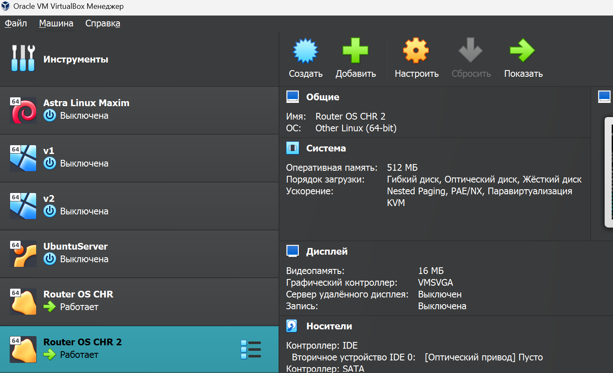

#### University: [ITMO University](https://itmo.ru/ru/)

##### Faculty: [FICT](https://fict.itmo.ru)

##### Course: [Network Programming](https://itmo-ict-faculty.github.io/network-programming/)

Group: K34202

Author: Konovalenko Maxim Pavlovich

Lab: Lab2

Date of create: 06.12.2023

Date of finished: 06.12.2023

## Отчёт по лабораторной работе №2 "Развертывание дополнительного CHR, первый сценарий Ansible"

**Цель работы:** Целью данной работы является c помощью Ansible настроить несколько сетевых устройств и собрать информацию о них. Правильно собрать файл Inventory.

**Ход работы:**

### 1. Установить второй CHR на своем ПК.

Запустив VirtualBox, мы клонируем CHR из прошлой лабораторной работы, выбрираем полный тип клонирования, так будет создана новая машина, использующая файлы виртуальных жёстких дисков клонируемой машины и мы не сможем перенести новую машину на другой компьютер без переноса клонируемой.



### 2. Организация второго OVPN Client на втором CHR.

По аналогии настройки ovpn первого CHR, создаем новый username в OpenVPN User Permissions, добавляем для него профиль и скачиваем сертификат.


Дальше подключаемся к нашим запущенным CHR через WinBox, загружаем в файлы .ovpn, импортируем сертификаты через терминал командой <code>certificate import file-name=fileName</code> и настраиваем на них interface с ovpn.


### 3. Настройка CHR при помощи Ansible.

Схема сети:


Чтобы подключаться к устройствам по ssh, необходимо установить зависимость ansible-pylibssh.

Для настройки Ansible создадим файл инвентаря [hosts.ini](config/hosts.ini), в котором указаны данные об устройствах для настройки.


```
[chr]
chr1 ansible_host=172.27.224.6
chr2 ansible_host=172.27.224.7

[chr:vars]
ansible_connection=ansible.netcommon.network_cli
ansible_network_os=community.routeros.routeros
ansible_user=admin
ansible_ssh_pass=admin
```

Тестирование подключения через файл инвентаря hosts.ini при помощи ad-hoc команды ping


Также создадим [ansible-playbook](config/ansible-playbook.yml) - файл с командами для настройки конфигурации(Создание пользователей, создание NTP клиента, настройка OSPF с указанием Router ID, сбор данных конфигов устройств):

```
---
- name: CHR setting
  hosts: chr
  tasks:
    - name: Create users
      routeros_command:
        commands:
          - /user add name=maxim group=read password=adminadmin

    - name: Create NTP client
      routeros_command:
        commands:
          - /system ntp client set enabled=yes server=0.ru.pool.ntp.org

    - name: OSPF with router ID
      routeros_command:
        commands:
          - /interface bridge add name=loopback
          - /ip address add address=172.16.0.1 interface=loopback network=172.16.0.1
          - /routing id add disabled=no id=172.16.0.1 name=OSPF_ID select-dynamic-id=""
          - /routing ospf instance add name=ospf-1 originate-default=always router-id=OSPF_ID
          - /routing ospf area add instance=ospf-1 name=backbone
          - /routing ospf interface-template add area=backbone auth=md5 auth-key=admin interface=ether1

    - name: Get facts
      routeros_facts:
        gather_subset:
          - interfaces
      register: output_ospf

    - name: Print output
      debug:
        var: "output_ospf"

```

Запускаем выполнение ansible-playbook:

```
ansible-playbook -i hosts.ini ansible-playbook.yml
```

Результат выполнения скрипта:


Файлы [output-chr1](config/output_chr1.txt) и [output-chr2](config/output_chr2.txt) содержат данные сбора фактов после выполнения плейбука для каждой из машин.

### 4. Проверка конфигурации.

Пользователи, созданные на CHR:


NTP Clients:


Проверка связности ВМ, а также настроенный OSPF:


Полная конфигурация устройств:

- [CHR1](config/exp1.rsc)
- [CHR2](config/exp2.rsc)

## Вывод:

В результате выполнения работы c помощью Ansible были настроены несколько сетевых устройств и собраны информацию о них. Также правильно собраны файлы инвентаря.
