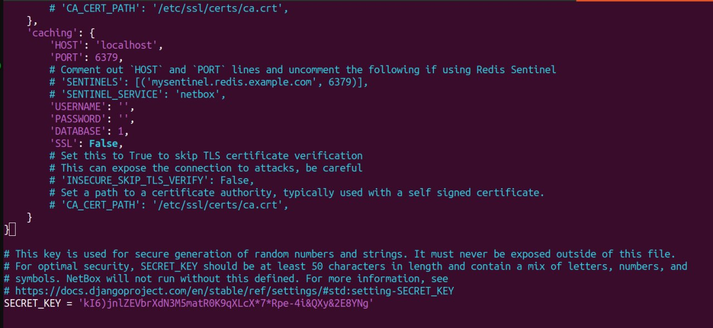

#### University: [ITMO University](https://itmo.ru/ru/)

##### Faculty: [FICT](https://fict.itmo.ru)

##### Course: [Network Programming](https://itmo-ict-faculty.github.io/network-programming/)

Group: K34202

Author: Konovalenko Maxim Pavlovich

Lab: Lab3

Date of create: 04.12.2023

Date of finished:

## Отчёт по лабораторной работе №3 "Развертывание Netbox, сеть связи как источник правды в системе технического учета Netbox"

**Цель работы:** С помощью Ansible и Netbox собрать всю возможную информацию об устройствах и сохранить их в отдельном файле.

**Ход работы:**

### 1. Поднятие Netbox.

Для работы с Netbox был установлен postgresql.

```
sudo apt update
sudo apt install -y postgresql
```

Также была содана база данных netbox, и в ней пользователь netbox с паролем admin


Установка redis командой _sudo apt install -y redis-server_ и проверка установки _redis-cly ping_.


##### Установка Python

```
sudo apt install -y python3 python3-pip python3-venv python3-dev build-essential libxml2-dev libxslt1-dev libffi-dev libpq-dev libssl-dev zlib1g-dev
```


##### Установка Netbox

Полная документация по установке Netbox находится [тут](https://docs.netbox.dev/en/stable/installation/3-netbox/).

Сперва скачиваем git:

```
sudo apt install -y git
```

Клонируем ветку master NetBox с репозитория GitHub

```
sudo mkdir -p /opt/netbox/
cd /opt/netbox/
sudo git clone -b master --depth 1 https://github.com/netbox-community/netbox.git .
```


##### Конфигурация Netbox

Переходим в директорию с конфигурацией и делаем копию файла configuration_example.py в файл configuration.py

```
cd /opt/netbox/netbox/netbox/
sudo cp configuration_example.py configuration.py
```

Отредактируем файл configuration.py. Измененный конфиг:




##### Генерация секретного ключа

Генерация секретного ключа, который после мы добавили в конфигурацию netbox'а

```
python3 ../generate_secret_key.py
```

##### Запуск сценария обновления

```
sudo /opt/netbox/upgrade.sh
```

##### Создание суперпользователя

Cоздание суперпользователя, чтобы иметь возможность войти в NetBox. Сначала войдем в виртуальную среду Python, созданную сценарием обновления:

```
source /opt/netbox/venv/bin/activate
```

Далее мы создадим учетную запись суперпользователя с помощью команды управления createsuperuser Django (через manage.py).

```
cd /opt/netbox/netbox
python3 manage.py createsuperuser
```

##### Запуск NetBox

```
python3 manage.py runserver 0.0.0.0:8000 --insecure
```

После запуска мы можем открыть netbox по публичному адресу сервера, добавив 8000 порт. Авторизация происходит под учетной записью созданного пользователя.


### 2. Заполнение инмформации о CHR в NetBox.

Добавили информацию о CHR. Созданы 2 роутера.
Для добавления ip-адресов были добавлены интерфейсы для роутеров(во вкладке devices), позже на каждый интерфейс были назначены ip-адреса, после самими роутерам назначен ip.


### 3. Сохранение всех данных из NetBox, использкя Ansible.

Установка модуля netbox для Ansible

```
ansible-galaxy collection install netbox.netbox
```

Был создан файл netbox_cinf_galaxy.yml


Токен был взят по адресу http://public_url:8000/user/api-tokens/


Сохранение вывода скрипта в файл netbox_inventory.yml

```
ansible-inventory -v --list -y -i netbox_conf_galaxy.yml > netbox_inventory.yml
```

Информацию об устройствах в YAML-формате теперь можно найти в [файле](configs/netbox_inventory%20copy.yml)

### 4. Cценарий, при котором на основе данных из Netbox можно настроить 2 CHR, изменить имя устройства, добавить IP адрес на устройство.

Добавили переменные в [файл](configs/inventory/netbox_inventory.yml) для подключения к роутерам.

```
vars:
    ansible_connection: ansible.netcommon.network_cli
    ansible_network_os: community.routeros.routeros
    ansible_user: admin
    ansible_ssh_pass: 12345
```

Напиcан playbook для изменения имени устройства и добавления IP:


Запустили playbook командой:

```
ansible-playbook -i inventory ansible-playbook.yml
```


### 5. Сценарий, позволяющий собрать серийный номер устройства и вносящий серийный номер в Netbox.

Был написан [сценарий](configs/serial_number-playbook.yml), который вносит серийный номер устройства в NetBox.

Выполняем написанный сценарий командой:

```
ansible-playbook -i inventory serial_number-playbook.yml
```


В результате видим измененные серийные номера


### Результаты лабораторной работы:

[Файл данных из NetBox](configs/netbox_inventory%20copy.yml)

Файлы сценария:

1. [Playbook ip](configs/ansible-playbook.yml) / [Playbook ip](configs/inventory/netbox_inventory.yml)
2. [Playbook serial number](configs/serial_number-playbook.yml)

Схема связи.


Результаты пингов:


### Вывод:

В результате выполнения лабораторной работы c помощью инструментов Ansible и Netbox была собрана вся возможная информация об устройствах и сохранена в отдельном файле.
