#### University: [ITMO University](https://itmo.ru/ru/)

##### Faculty: [FICT](https://fict.itmo.ru)

##### Course: [Network Programming](https://itmo-ict-faculty.github.io/network-programming/)

Group: K34202

Author: Konovalenko Maxim Pavlovich

Lab: Lab3

Date of create: 14.12.2023

Date of finished: 17.12.2023

## Отчёт по лабораторной работе №4 "Базовая 'коммутация' и туннелирование используя язык программирования P4"

**Цель работы:** С помощью Ansible и Netbox собрать всю возможную информацию об устройствах и сохранить их в отдельном файле.

**Ход работы:**

### 1. Подготовка к выполнению работы.

Был склонирован репозиторий [p4lang/tutorials](https://github.com/p4lang/tutorials)

```
git clone https://github.com/p4lang/tutorials.git
```

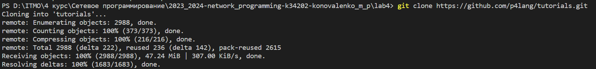

Также были установлены Vagrant и VirtualBox

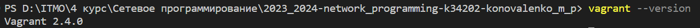

Дальше мы перешли в директорию vm-ubuntu-20.04 склонированного репозитория и, используя Vagrant, развернули тестовую среду

```
vagrant up
```

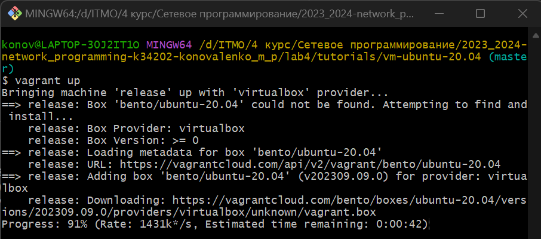

В результате установки у нас появилась виртуальная машина с аккаунтами login/password vagrant/vagrant и p4/p4

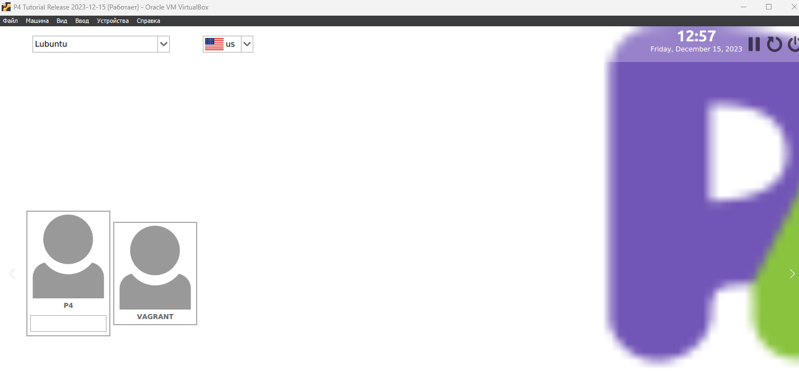

### 2. Implementing Basic Forwarding.

В данном задании мы дополнили скрипт basic.p4 так, чтобы в сети заработала переадресация IP-пакетов.


Перед этим давайте скомпилируем неполный файл Basic.p4 и запустим переключатель в Mininet, чтобы проверить его поведение.

```
make run
```

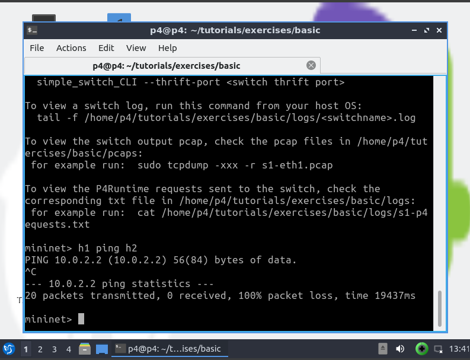

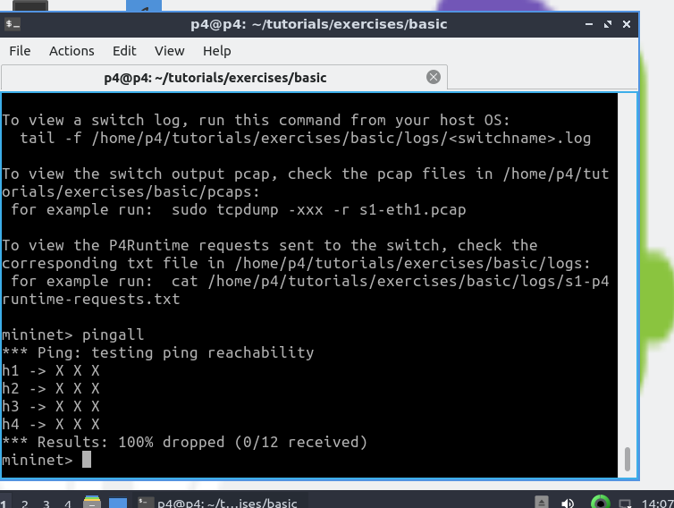
Отсутсвие соединения между устройствами.

Ошибка ping, так как каждый переключатель запрограммирован в соответствии с basic.p4, который сбрасывает все пакеты по прибытии. Наша задача - дополнить этот файл, чтобы он пересылал пакеты.

TODO: Парсеры для Ethernet и IPv4, которые заполняют поля ethernet_t и ipv4_t.

```
parser MyParser(packet_in packet,
                out headers hdr,
                inout metadata meta,
                inout standard_metadata_t standard_metadata) {

    state start {
        transition parse;
        }

    state parse{
      packet.extract(hdr.ethernet);
      transition select(hdr.ethernet.etherType) {
        TYPE_IPV4: parse_ipv4;
        default: accept;
        }
    }

    state parse_ipv4{
      packet.extract(hdr.ipv4);
      transition accept;
    }
}
```

TODO: An action (called ipv4_forward) that:

- Устанавливает выходной порт для следующего перехода..
- Обновляет адрес назначения Ethernet адресом следующего перехода.
- Обновляет исходный адрес Ethernet адресом свича.
- Уменьшает TTL.

TODO: A control that:

1. Определяет таблицу, которая будет считывать адрес назначения IPv4, и вызывает либо drop, либо ipv4_forward.
2. Блок Apply, применяющий таблицу.

```
control MyIngress(inout headers hdr,
                  inout metadata meta,
                  inout standard_metadata_t standard_metadata) {
    action drop() {
        mark_to_drop(standard_metadata);
    }

    action ipv4_forward(macAddr_t dstAddr, egressSpec_t port) {
        standard_metadata.egress_spec= port;
        hdr.ethernet.srcAddr = hdr.ethernet.dstAddr;
        hdr.ethernet.dstAddr = dstAddr;
        hdr.ipv4.ttl = hdr.ipv4.ttl - 1;
    }

    table ipv4_lpm {
        key = {
            hdr.ipv4.dstAddr: lpm;
        }
        actions = {
            ipv4_forward;
            drop;
            NoAction;
        }
        size = 1024;
        default_action = NoAction();
    }

    apply {
        if (hdr.ipv4.isValid()) {
            ipv4_lpm.apply();
        }
    }
}
```

TODO: Депарсер, который выбирает порядок, в котором поля вставляются в исходящий пакет.

```
control MyDeparser(packet_out packet, in headers hdr) {
    apply {
        packet.emit(hdr.ethernet);
        packet.emit(hdr.ipv4);
    }
}
```

[Измененный файл basic.p4](files/basic.p4)
Результат пингов после дополнения всех TODO:

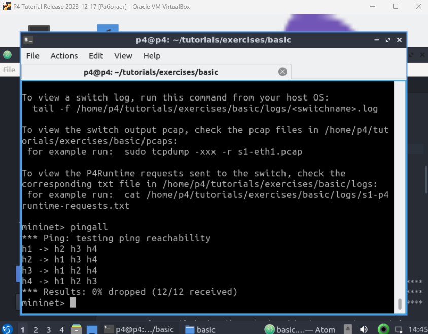

### 3. Implementing Basic Tunneling.

Файл basic_tunnel.p4 содержит реализацию базового IP-маршрутизатора. В нем также есть комментарии, помеченные как TODO, которые указывают на функциональность, которую нам нужно реализовать. Полная реализация коммутатора basic_tunnel.p4 будет способна пересылать пакеты на основе содержимого пользовательского инкапсуляционного заголовка, а также выполнять обычную маршрутизацию IP, если инкапсуляционный заголовок отсутствует в пакете.


TODO: Обновите парсер для извлечения заголовка myTunnel или ipv4-заголовка на основе поля etherType в Ethernet-заголовке

```
// TODO: Update the parser to parse the myTunnel header as well
parser MyParser(packet_in packet,
                out headers hdr,
                inout metadata meta,
                inout standard_metadata_t standard_metadata) {

    state start {
        transition parse_ethernet;
    }

    state parse_ethernet {
        packet.extract(hdr.ethernet);
        transition select(hdr.ethernet.etherType) {
            TYPE_MYTUNNEL: parse_myTunnel;
            TYPE_IPV4: parse_ipv4;
            default: accept;
        }
    }

    state parse_myTunnel {
        packet.extract(hdr.myTunnel);
        transition select(hdr.myTunnel.proto_id) {
            TYPE_IPV4: parse_ipv4;
            default: accept;
        }
    }

    state parse_ipv4 {
        packet.extract(hdr.ipv4);
        transition accept;
    }
}
```

TODO: Объявим новое действие myTunnel_forward(egressSpec_t port) и новую таблицу myTunnel_exact, которая выполняет точное сопоставление с полем dst_id заголовка myTunnel.

А также обновим оператор apply в блоке управления MyIngress для применения нашей вновь определенной таблицы myTunnel_exact

```
control MyIngress(inout headers hdr,
                  inout metadata meta,
                  inout standard_metadata_t standard_metadata) {
    action drop() {
        mark_to_drop(standard_metadata);
    }

    action ipv4_forward(macAddr_t dstAddr, egressSpec_t port) {
        standard_metadata.egress_spec = port;
        hdr.ethernet.srcAddr = hdr.ethernet.dstAddr;
        hdr.ethernet.dstAddr = dstAddr;
        hdr.ipv4.ttl = hdr.ipv4.ttl - 1;
    }

    table ipv4_lpm {
        key = {
            hdr.ipv4.dstAddr: lpm;
        }
        actions = {
            ipv4_forward;
            drop;
            NoAction;
        }
        size = 1024;
        default_action = drop();
    }

    // TODO: declare a new action: myTunnel_forward(egressSpec_t port)

    action myTunnel_forward(egressSpec_t port) {
        standard_metadata.egress_spec = port;
    }

    // TODO: declare a new table: myTunnel_exact
    // TODO: also remember to add table entries!

    table myTunnel_exact {
        key = {
            hdr.myTunnel.dst_id: exact;
        }
        actions = {
            myTunnel_forward;
            drop;
        }
        size = 1024;
        default_action = drop();
    }

    apply {
        // TODO: Update control flow
        if (hdr.ipv4.isValid() && !hdr.myTunnel.isValid()) {
            ipv4_lpm.apply();
        }

        if (hdr.myTunnel.isValid()) {
            myTunnel_exact.apply();
        }
    }
}
```

TODO: Обновим депарсер

```
control MyDeparser(packet_out packet, in headers hdr) {
    apply {
        packet.emit(hdr.ethernet);

        // TODO: emit myTunnel header as well

        packet.emit(hdr.myTunnel);
        packet.emit(hdr.ipv4);
    }
}
```

[Измененный файл basic_tunnel.p4](files/basic_tunnel.p4)

Результат после дополнения кода:

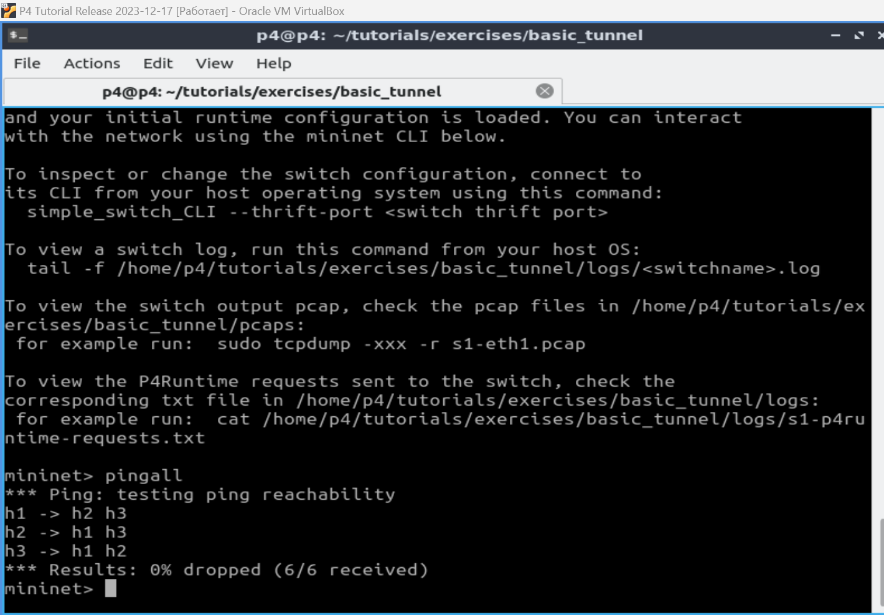

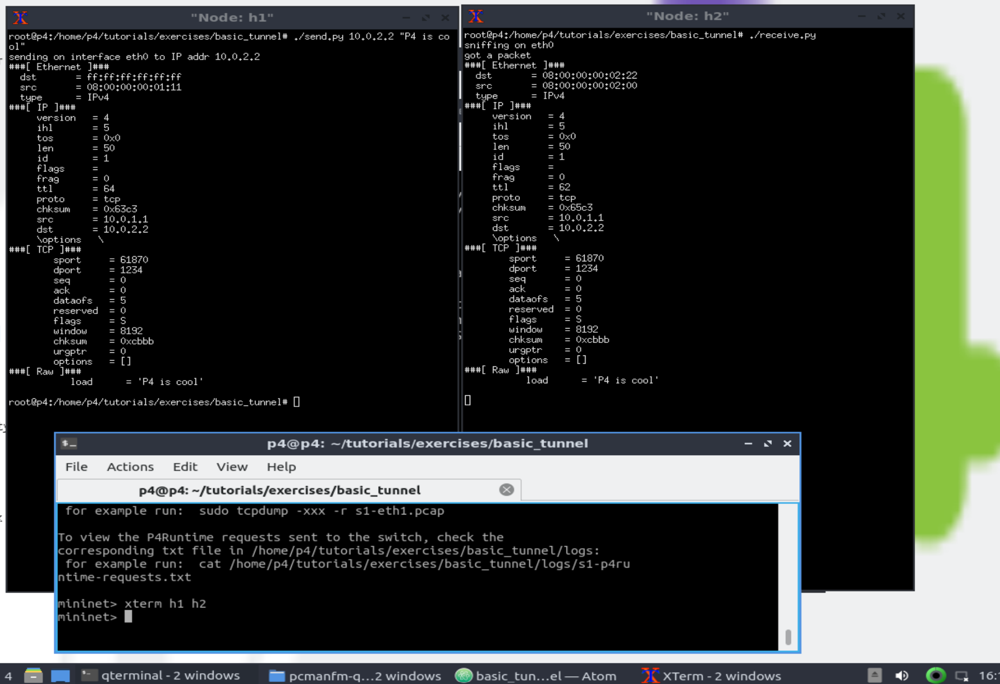
Пакет должен быть получен на h2. Полученный пакет состоит из заголовка Ethernet, заголовка IP, заголовка TCP и сообщения. Если мы изменим IP-адрес назначения (например, отправить на 10.0.3.3), то сообщение не будет получено h2, а вместо этого будет получено h3.

Теперь мы проверяем с туннелированием:

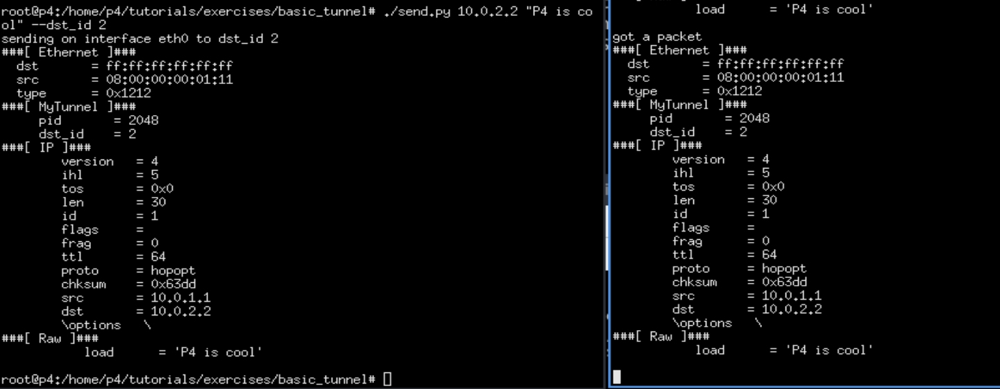
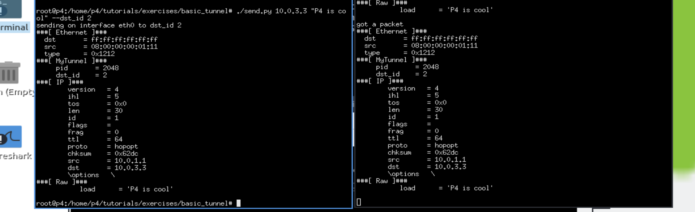

Коммутатор не использует IP-заголовок для маршрутизации, когда в пакете присутствует заголовок MyTunnel.

## Вывод:

В результате выполнения работы был изучен синтаксис языка программирования P4 и выполнены 2 обучающих задания от Open network foundation для ознакомления на практике с P4.
